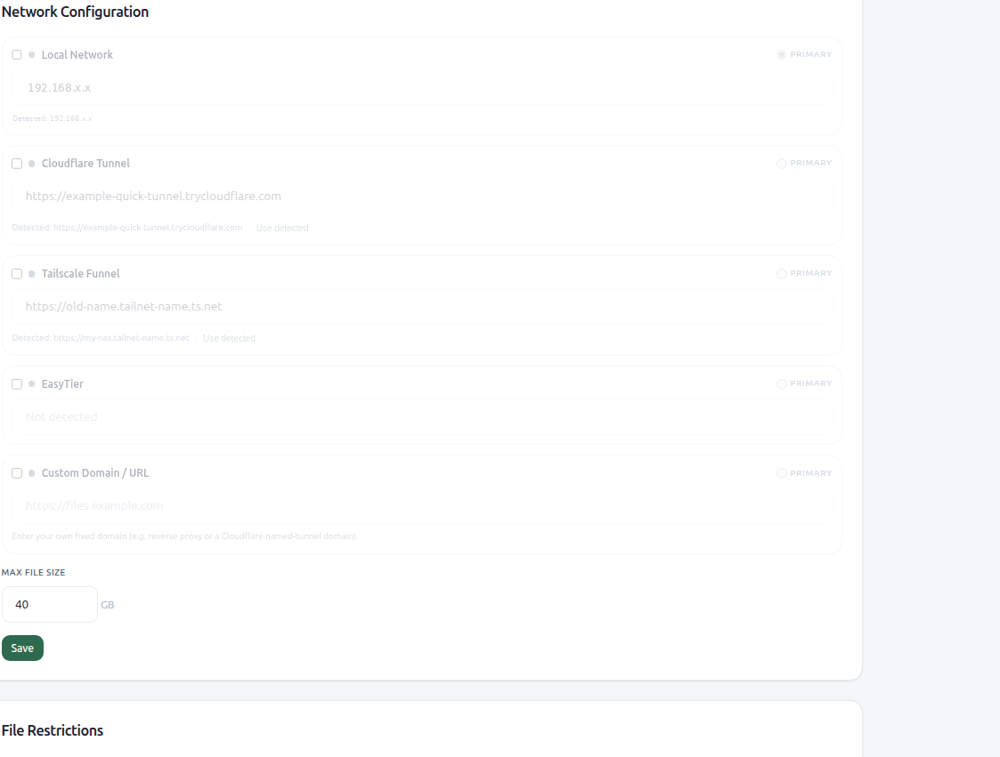
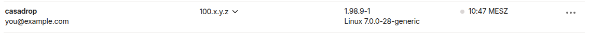
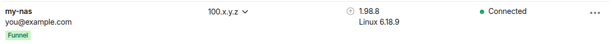

# CasaDrop with Tailscale

Reach CasaDrop from anywhere without opening a port in your router, and — if you
want — hand out share links that work on the public internet.

There are two ways to wire this up, and the right one depends on whether you
already run Tailscale on the host:

| | **Variant A — your existing Tailscale** | **Variant B — the bundled sidecar** |
|---|---|---|
| Tailscale runs… | on the host (systemd service, ZimaOS sysext, or another container) | in a `tailscale/tailscale` container next to CasaDrop |
| Tailnet node | the host itself | a separate node, e.g. `casadrop` |
| CasaDrop auto-detects the URL | **yes** — the entrypoint reads `tailscale status` | **no** — set it yourself (see §3.4) |
| Extra install | none | one more container + a state volume |
| Best for | ZimaOS / any box already on your tailnet | a host with no Tailscale yet |

Both variants end with the same result: `https://<node>.<tailnet>.ts.net`
serving CasaDrop with a valid Let's Encrypt certificate.

**Terminology.** `tailscale serve` publishes a service **inside your tailnet
only** (your own devices). `tailscale funnel` publishes it **on the public
internet**. Everything below says explicitly which one it uses.

---

## 1. Prerequisites

* A Tailscale account and a tailnet (free plan is enough).
* CasaDrop running and reachable locally — check first:

  ```bash
  curl -s http://localhost:8086/healthz     # → ok
  ```

  Replace `8086` with your published port (`WEBUI_PORT`).
* For **Funnel** (public access) only: HTTPS and Funnel must be enabled for your
  tailnet in the admin console — see §4.

---

## 2. Variant A — use the Tailscale you already run

This is the variant to pick on ZimaOS, or on any host that is already a tailnet
node. CasaDrop does not run its own Tailscale; it *borrows* the host's daemon
through a mounted socket, which is also what makes URL auto-detection work.

### 2.1 Mount the CLI and the socket into the container

Add two mounts to the CasaDrop service:

```yaml
services:
  casadrop:
    volumes:
      - casadrop-data:/data
      # --- host Tailscale ---
      - /usr/bin/tailscale:/usr/bin/tailscale:ro
      - /run/tailscale/tailscaled.sock:/var/run/tailscale/tailscaled.sock
```

Notes:

* The `tailscale` binary is statically linked, so the host binary runs fine
  inside the Alpine image.
* The socket must be mounted **read-write** — the CLI writes requests to it. The
  binary itself is read-only.
* The socket path differs between host and container on purpose:
  `/run/tailscale/…` on the host, `/var/run/tailscale/…` inside, which is where
  the CLI looks by default.
* On ZimaOS these mounts are already prepared (commented out) in
  `docker-compose.zimaos.yaml`.

Recreate the container afterwards:

```bash
docker compose up -d
```

### 2.2 Check that CasaDrop found the tailnet

The entrypoint runs `tailscale status --json`, takes the node's `DNSName` and
exports it as `TAILSCALE_URL`. You can see it in the startup log:

```bash
docker logs casadrop | head -20
```

```
=== CasaDrop Starting ===
Port: 8080
Data: /data
Tailscale IP: 100.x.y.z
Tailscale URL: https://my-nas.tailnet-name.ts.net
Local IP: 172.19.0.2
=== Starting CasaDrop Server ===
```

If the two `Tailscale …` lines are missing, the mounts are wrong — verify from
inside the container:

```bash
docker exec casadrop tailscale status
```

### 2.3 Publish CasaDrop inside your tailnet (`serve`)

Run this **on the host**, not in the container:

```bash
tailscale serve --bg --https=8444 http://127.0.0.1:8086
```

```
Available within your tailnet:

https://my-nas.tailnet-name.ts.net:8444/
|-- proxy http://127.0.0.1:8086

Serve started and running in the background.
To disable the proxy, run: tailscale serve --https=8444 off
```

Any port works; a dedicated one (`8444` here) is convenient because it leaves an
existing `--https=443` entry — e.g. your NAS dashboard — untouched. To put
CasaDrop on the node's root URL instead, use `--https=443`, but be aware it
replaces whatever was on 443 before. Check what is configured first:

```bash
tailscale serve status
```

Now open the URL from any device in your tailnet:


The certificate is a real Let's Encrypt certificate issued for the node name — no
browser warning, and `Secure` cookies work:

```bash
echo | openssl s_client -connect my-nas.tailnet-name.ts.net:8444 \
        -servername my-nas.tailnet-name.ts.net 2>/dev/null |
  openssl x509 -noout -issuer -subject
```

```
issuer=C = US, O = Let's Encrypt, CN = YE2
subject=CN = my-nas.tailnet-name.ts.net
```

### 2.4 Select the network in CasaDrop's settings

Log in as admin → **Settings** → **Network Configuration**. The Tailscale card
shows what the entrypoint detected:



* Tick the checkbox on the **Tailscale Funnel** card — while it is unchecked the
  whole card is disabled: URL field, **PRIMARY** radio and **Use detected** are
  all greyed out.
* Click **Use detected** to take over the auto-detected value. This button only
  appears when the stored value differs from the detected one — handy when a node
  gets renamed (in the screenshot the stored URL is still the node's old name
  while detection already sees the new one).
* Select **PRIMARY** if share links should use the Tailscale URL by default, then
  **Save**.

> **The primary network is only the fallback.** If a visitor reaches CasaDrop
> through a public hostname, the generated share/receive/QR links use *that*
> host, so they match the way the page was actually opened
> (`utils.PreferredPublicBaseURL`). Only local/LAN/loopback access falls back to
> the primary network you picked here. A `*.ts.net` name always counts as
> public.

---

## 3. Variant B — the bundled Tailscale sidecar

CasaDrop's compose files ship an optional `tailscale` service behind the
`tailscale` profile. It creates its **own** tailnet node and shares the network
namespace with the app container (`network_mode: service:casadrop`), so
`localhost:8080` inside the sidecar *is* CasaDrop.

### 3.1 Start it

With an auth key (unattended):

```bash
TAILSCALE_AUTHKEY=tskey-auth-xxxx docker compose --profile tailscale up -d
```

Both spellings `TAILSCALE_AUTHKEY` and `TS_AUTHKEY` are accepted, in
`docker-compose.yaml` and `docker-compose.zimaos.yaml` alike. Create a key at
<https://login.tailscale.com/admin/settings/keys>.

> **Use an auth key. The interactive login does not work reliably here.**
> Started without `TS_AUTHKEY`, the container's supervisor retries the login
> about once a minute, generating a **new** node key and a **new** auth URL each
> time:
>
> ```
> 08:37:18  https://login.tailscale.com/a/aaaaaaaaaaaa
> 08:38:18  https://login.tailscale.com/a/bbbbbbbbbbbb   ← different key, different URL
> 08:39:18  https://login.tailscale.com/a/cccccccccccc
> …
> ```
>
> Any URL you copy is stale within ~60 seconds, and even a login that succeeds is
> superseded by the next key regeneration — the node registers in your tailnet
> and then goes stale, while the container still reports `Logged out.` Use an
> ephemeral or reusable auth key instead.

Once the node is up it appears in your tailnet as its own machine, separate from
the host:



Verify from the command line too:

```bash
docker exec casadrop-tailscale tailscale status
```

### 3.2 What the sidecar needs

Already set in the shipped compose files — listed here so you know why:

| Setting | Why |
|---|---|
| `cap_add: NET_ADMIN` | create the `tailscale0` interface |
| `/dev/net/tun:/dev/net/tun` | kernel TUN device, bind-mounted instead of granting `SYS_MODULE` |
| `tailscale-state:/var/lib/tailscale` | keeps the node identity across restarts — without it you re-authenticate every time |
| `network_mode: service:casadrop` | shares the app's network namespace, so `localhost:8080` reaches CasaDrop |

`SYS_MODULE` is deliberately **not** granted (it is equivalent to host root). If
your host has no `tun` device, run `modprobe tun` once on the host instead.

### 3.3 Publish CasaDrop

Because the sidecar shares CasaDrop's namespace, the target is the **container**
port `8080`, not your published host port:

```bash
# inside your tailnet only
docker exec casadrop-tailscale tailscale serve --bg 8080

# public internet (see §4 first)
docker exec casadrop-tailscale tailscale funnel --bg 8080
```

Check what is live:

```bash
docker exec casadrop-tailscale tailscale funnel status
```

### 3.4 Tell CasaDrop its URL — it cannot detect it here

In this variant the `tailscale` CLI lives in the **sidecar**, not in the app
container, so the entrypoint's auto-detection finds nothing:

```bash
docker exec casadrop sh -c 'command -v tailscale || echo "no tailscale binary in app container"'
```

```
no tailscale binary in app container
```

So set the URL yourself, either as an environment variable…

```yaml
services:
  casadrop:
    environment:
      - TAILSCALE_URL=https://casadrop.your-tailnet.ts.net
```

…or by typing it into **Settings → Network Configuration → Tailscale Funnel**
(tick the checkbox first, then fill the field and **Save**). Both places accept
the same value, but they are not equal partners: **the settings field wins, and
`TAILSCALE_URL` is only the fallback used when that field is empty.** So once you
have saved a URL in Settings, changing the environment variable has no effect
until you clear the field again. The saved value is written to
`data/tunnel_config.json` — a file in your data volume, not a row in the
database — so it survives restarts and is what you edit or delete to hand
control back to the environment variable.

---

## 4. Public access with Funnel

`serve` stays inside your tailnet. To hand a link to somebody who is *not* on
your tailnet, you need **Funnel**, and Funnel must be granted in your tailnet
policy — otherwise the node's public DNS name does not resolve even though the
local config looks fine.

1. Open <https://login.tailscale.com/admin/dns> and make sure **HTTPS
   Certificates** are enabled.
2. Open <https://login.tailscale.com/admin/acls> and grant the `funnel`
   attribute to the node (or to a tag it carries):

   ```jsonc
   "nodeAttrs": [
     { "target": ["autogroup:member"], "attr": ["funnel"] },
   ]
   ```

   Once a node is allowed to use Funnel, the admin console marks it with a
   **Funnel** badge:

   

3. Turn it on:

   ```bash
   # Variant A, on the host
   tailscale funnel --bg --https=443 http://127.0.0.1:8086

   # Variant B, in the sidecar
   docker exec casadrop-tailscale tailscale funnel --bg 8080
   ```

4. Verify from **outside** your tailnet — a phone on mobile data is the honest
   test. `tailscale funnel status` only reports your local configuration; it says
   nothing about whether the world can actually reach you.

> **Funnel makes CasaDrop reachable by anyone who has the link.** Before you
> enable it: set a strong admin password (or `ADMIN_PASSWORD`), consider
> enabling 2FA under **Settings → Two-Factor Authentication**, and put a password
> and an expiry on shares that matter.

---

## 5. Bonus: Taildrop — send a share to one of your devices

With Variant A, CasaDrop can push a shared file straight to another device on
your tailnet (**admin only**, file shares only — not folder shares). A "Send to
device" action appears on a share once `GET /api/taildrop/status` reports
`available: true`.

It runs `tailscale file cp` under the hood, and **writing** through the socket
needs more privilege than reading: `tailscale status` works for any user, but
`tailscale file cp` requires the caller to be root or the configured *operator*.
If the device list populates but sending fails with `Access denied: file access
denied`, set the operator once on the host:

```bash
sudo tailscale set --operator=<the user your CasaDrop container runs as>
```

---

## 6. Troubleshooting

**`docker logs casadrop` shows no `Tailscale URL:` line (Variant A)**
The mounts are missing or wrong. Check with
`docker exec casadrop tailscale status` — if that fails, fix §2.1. Also make sure
the socket is mounted read-write.

**The URL in Settings is an old node name**
Node was renamed. Use the **Use detected** button on the Tailscale card, then
**Save**.

**`https://<node>.<tailnet>.ts.net` opens something else**
Another `tailscale serve` entry already owns that port. `tailscale serve status`
lists them; publish CasaDrop on its own port (`--https=8444`) or take over 443
deliberately.

**Public DNS name does not resolve, tailnet access works**
Funnel is not granted in the tailnet policy — §4, step 2. Serve config and
certificate can be perfectly fine while this is missing.

**The share link points at `192.168.x.x` although I opened the ts.net URL**
That should not happen — links follow the host you came in through. If it does,
check whether a reverse proxy in front is rewriting `Host`/`X-Forwarded-Host`,
and set `TRUSTED_PROXY` to that proxy's IP/CIDR so the forwarded headers are
honored.

**Sidecar asks for authentication on every restart (Variant B)**
The `tailscale-state` volume is not persisted. Check the volume mapping for
`/var/lib/tailscale`.

---

## 7. Which one should I use?

* **Already on the tailnet** (ZimaOS, any host with Tailscale) → **Variant A**.
  Fewer moving parts, one node instead of two, URL auto-detection, and Taildrop
  works.
* **Host has no Tailscale** and you want CasaDrop self-contained → **Variant B**.
  One `--profile tailscale` and you are done; just remember to set
  `TAILSCALE_URL` (§3.4).
